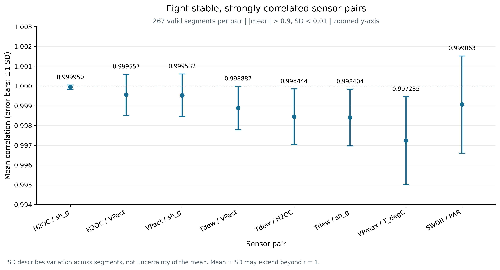
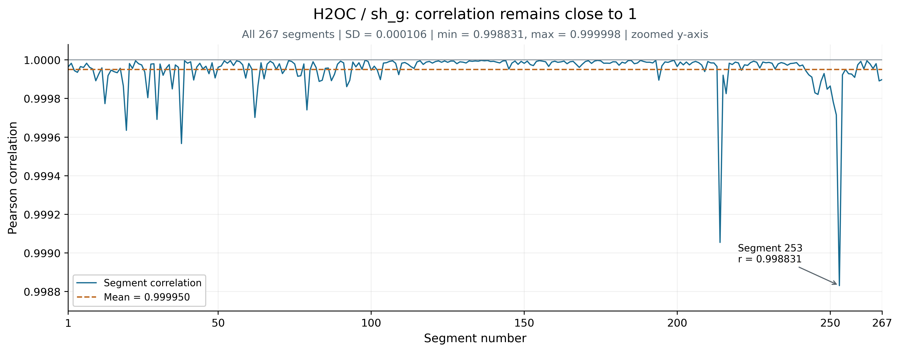
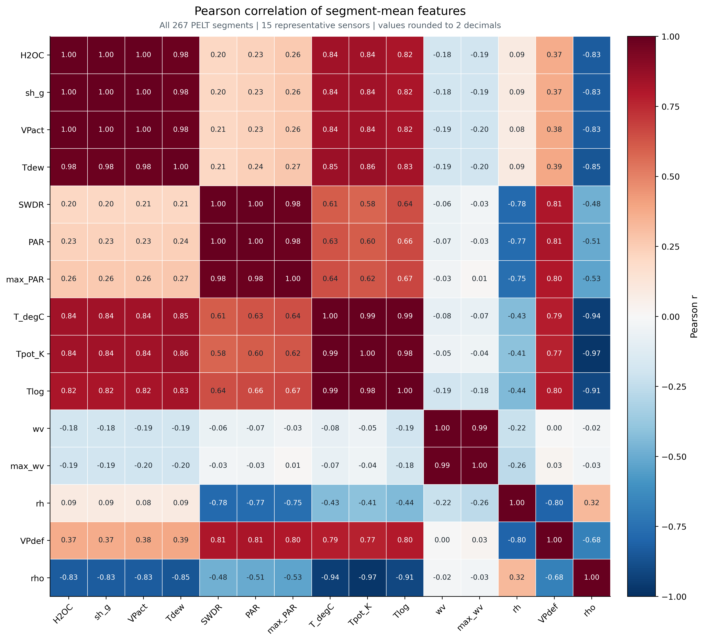
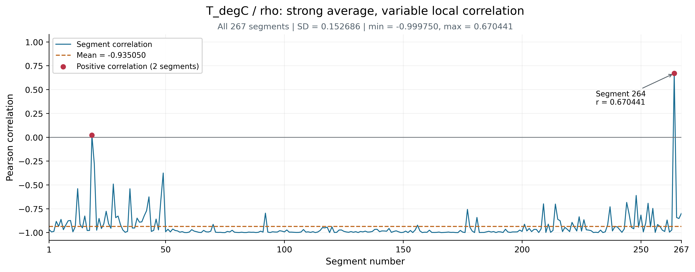

# PELT 分段相关性与统计特征冗余分析

本实验对全部267个PELT分段进行分析，数据覆盖2020年1月1日至2021年1月1日，包含21个传感器、210个传感器两两相关系数及357个单传感器统计特征。各分段等权参与统计，跨分段标准差采用样本标准差（ddof=1）。分析区分两个层面：一是段内传感器相关系数在不同分段之间的稳定性；二是最终统计特征在267个分段之间的Pearson相关性。

## 稳定强相关关系

以相关系数均值绝对值大于0.9且跨分段标准差小于0.01为筛选条件，共得到8对稳定强相关关系，所有入选关系均有267个有效分段。H2OC/sh_g最稳定，均值为0.999950，标准差为0.000106，最小值仍为0.998831。H2OC、sh_g、VPact和Tdew之间的6对关系全部满足筛选条件，另外两对为VPmax/T_degC与SWDR/PAR。

图1　8对稳定强相关关系的均值及±1个跨分段标准差。纵轴为放大范围；误差棒反映分段间离散程度，并非均值的置信区间。均值加减标准差可能超出相关系数的理论上界，不代表存在大于1的观测值。

表1列出10对代表性关系，其中valid_ratio表示剔除相关系数分母过小的分段后，有效分段占全部267个分段的比例。

| pair | mean | std | min | max | range | valid_ratio | interpretation |
| --- | --- | --- | --- | --- | --- | --- | --- |
| H2OC / sh_g | 0.999950 | 0.000106 | 0.998831 | 0.999998 | 0.001167 | 1.000000 | 最稳定的相关关系，全部分段接近1 |
| H2OC / VPact | 0.999557 | 0.001037 | 0.991918 | 0.999994 | 0.008076 | 1.000000 | 稳定强正相关，跨分段变化很小 |
| VPact / sh_g | 0.999532 | 0.001078 | 0.991873 | 0.999994 | 0.008121 | 1.000000 | 稳定强正相关，跨分段变化很小 |
| Tdew / VPact | 0.998887 | 0.001100 | 0.991567 | 0.999898 | 0.008332 | 1.000000 | 稳定强正相关，跨分段变化很小 |
| Tdew / H2OC | 0.998444 | 0.001412 | 0.990229 | 0.999810 | 0.009581 | 1.000000 | 稳定强正相关，跨分段变化很小 |
| Tdew / sh_g | 0.998404 | 0.001435 | 0.990176 | 0.999795 | 0.009619 | 1.000000 | 稳定强正相关，跨分段变化很小 |
| VPmax / T_degC | 0.997235 | 0.002225 | 0.984721 | 0.999856 | 0.015135 | 1.000000 | 稳定强正相关，跨分段变化很小 |
| SWDR / PAR | 0.999063 | 0.002459 | 0.970919 | 0.999916 | 0.028996 | 1.000000 | 稳定强正相关，跨分段变化很小 |
| VPdef / rh | -0.976689 | 0.028356 | -0.999809 | -0.720428 | 0.279380 | 1.000000 | 整体强负相关，但部分分段相关程度减弱 |
| T_degC / rho | -0.935050 | 0.152686 | -0.999750 | 0.670441 | 1.670192 | 1.000000 | 平均强负相关，但局部大幅波动并出现正相关 |

图2　H2OC/sh_g在267个分段中的相关系数。纵轴经过放大，全部观测值介于0.998831和0.999998之间，说明微小波动下仍保持接近1的相关关系。横轴表示分段编号，各分段的实际持续时间并不相等。

## 统计特征冗余

选取15个代表性传感器的mean特征，计算跨分段Pearson相关矩阵，如图3所示。图中系数表示两个段均值序列之间的相关性，不是段内相关系数的平均值。数值显示为两位小数，显示1.00不代表完全相等。

图3　15个传感器mean特征在全部267个分段之间的Pearson相关矩阵。标签省略公共前缀和单位。

在全部357个统计特征中，排除自相关和对称重复后，共发现888对特征满足|r|>0.95。5个min特征在所有分段中均为0，其对应变量为SWDR、PAR、max_PAR、raining_s和rain_mm，因此这5个变量各自的max与peak_to_peak完全相同。进一步逐传感器验证了iqr=q75−q25、peak_to_peak=max−min、rms²=mean²+std²以及crest_factor的定义，共84项公式检查全部通过，其中源文件std为段内总体标准差。为避免直接派生关系主导冗余总结，二次筛查移除5个常量特征和84个上述派生特征，剩余268列中仍存在568对|r|>0.95的关系。

湿度组的冗余最突出：H2OC/sh_g的mean相关系数为0.999998，std相关系数为0.999986；H2OC/VPact分别为0.999818和0.999544。但是Tdew/H2OC的mean相关系数为0.980281，std相关系数仅为0.747253，说明位置统计量冗余不能直接推广到波动统计量。H2OC、sh_g、VPact各自的mean、median、rms、q25和q75均两两高度相关，10个配对全部超过0.95。

辐射组中，SWDR/PAR的mean和std相关系数分别为0.999291和0.998811；SWDR/max_PAR的peak_to_peak相关系数为0.947116，未达到阈值。同一辐射变量内部也存在差别，例如SWDR的mean/rms相关系数为0.988884，而mean/median仅为0.862758。温度组中，T_degC/Tpot_K的mean和std相关系数分别为0.994313和0.997915；T_degC/Tlog的peak_to_peak相关系数为0.946038。风速组中，wv/max_wv的mean相关系数为0.985516，但peak_to_peak为0.940145。因此，冗余筛选应针对具体统计特征，而非按传感器组统一删除。

## 高平均相关但不稳定的反例

T_degC/rho的平均相关系数为−0.935050，平均相关绝对值较高，但跨分段标准差达到0.152686，取值范围为−0.999750至0.670441，极差为1.670192。其中2个分段出现正相关（分段编号：19, 264）。这说明强负相关的总体倾向并不能代表所有局部状态，相关系数随分段变化仍具有描述价值。

图4　T_degC/rho的跨分段相关系数。红点表示正相关分段，虚线为整体均值；图中保留−1至1的完整相关系数范围，以显示局部偏离和方向反转。

## 常量分段与伪零值

特征提取程序在相关系数分母不大于10⁻¹²时直接返回0。利用每段样本数n与两传感器段内总体标准差，可通过n×std_A×std_B≤10⁻¹²复核该条件。rain_mm在145个分段中为常量，占54.31%；raining_s在115个分段中为常量，占43.07%。全部相关系数列中的5089个零值均符合该无效条件，涉及39列；不存在全零或至少95%分段接近零（绝对值≤10⁻⁶）的correlation列。

这些占位零会压低跨分段波动，例如SWDR/rain_mm的原始标准差为0.094542，剔除145个无效分段后上升至0.135676。因此，占位零不能解释为真实的不相关，也不能据此认定相关关系稳定。上述8对稳定关系不存在此类无效分段。

## 对降维与特征选择的启示

后续特征选择可优先移除恒定列，并在完全重复特征中保留一个代表；针对H2OC、sh_g和VPact等高度冗余组合，分别在位置、波动及形态特征中选择代表，避免同一信息在距离计算中被重复计权。对统计波动很小的相关系数可开展删除前后的消融比较，但需注意标准化会重新放大这些列的微小变化。T_degC/rho等具有局部反转的相关特征，以及Tdew的波动特征，不宜仅依据高平均相关或变量含义删除。

公式可重建并不等于对所有模型都可无损删除，尤其rms与crest_factor为非线性派生特征。最终方案应结合聚类质量、稳定性和可解释性验证；如开展训练与测试评估，筛选规则及降维参数应仅在训练数据上拟合。上述结论是对本批267个分段的描述性分析，不将高相关直接解释为因果关系。
